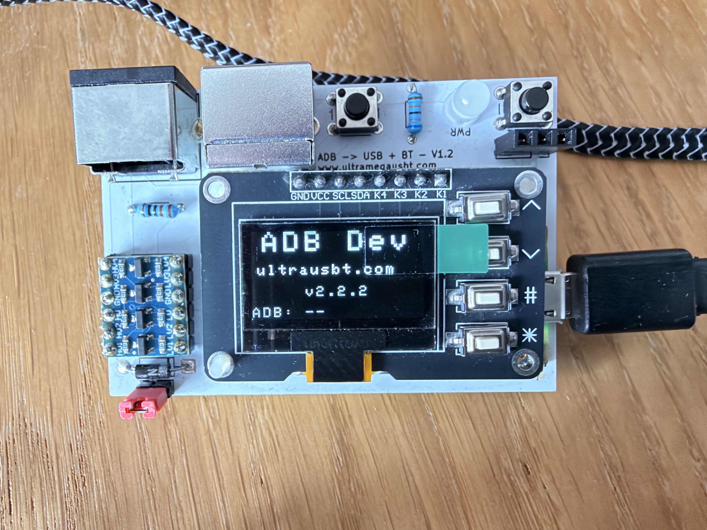
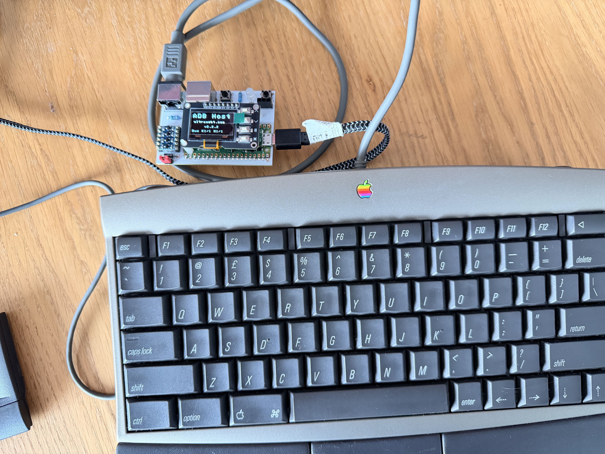

# Apple ADB USB & Bluetooth Adapter

## Overview

This project uses a Raspberry Pi Pico to connect modern USB and Bluetooth devices such as keyboards, mice, trackballs, and gamepads to classic Apple Desktop Bus (ADB) computers.

It targets **68K Macintosh** (Classic / LC / Quadra-class), **early PowerPC** ADB Macs (Performa / Power Macintosh), and the **Apple IIgs**. 
It should also work with ADB enabled **NeXT** machines but these have  **not** been tested yet.

A design for a reference adapter is included in the Repo. The adapter is bi-directional and can be toggled between device or host mode:

* **ADB Device** mode (default): attach USB and Bluetooth devices to an ADB host computer.





* **ADB Host** mode: connect original ADB devices (keyboard, mouse, trackballs, …) to a USB HID host such as a modern PC or Mac




The hardware can be configured with Dual Mini-DIN ADB ports, which are wired as an bus **pass-through**: you can daisy-chain real ADB keyboards, mice, trackballs, and other devices alongside the adapter’s USB/BT emulation (see [`docs/adb-passthrough-hub.md`](./docs/adb-passthrough-hub.md)).

If you are using a **Pico 2 W** you can mix USB and Bluetooth devices. USB-only builds work on Pico / Pico 2 as well. A **Pico 2 W** is recommended for the full feature set (Bluetooth + Device/Host toggle).

**This project and firmware descends from the HIDHopper ADB project and it's upstream line ( inc QuokkADB / adbuino )** (GPL) - see below for further info. 

## USB device support

* USB HID keyboards
* USB HID mice (and many trackballs that appear as mice)
* Bluetooth keyboards, mice, and one gamepad slot on Pico W / Pico 2 W (see below)

## Game controller support (Bluetooth)

One Bluetooth gamepad can be connected (Bluepad32). **Phase B** maps D-pad/buttons to keyboard keys and the left stick to mouse movement — useful without native ADB joystick firmware. Details: [`docs/gamepad-support.md`](./docs/gamepad-support.md).

Native Gravis MouseStick II (handler **0x23**) is planned for the future; see [`docs/FUTURE_WORK.md`](./docs/FUTURE_WORK.md).

# Usage

## USB

Connect devices to the Pico USB port (use a powered USB OTG hub if you need several). Supported keyboards and mice should enumerate within a few seconds; confirm on the OLED.

**Before powering on the Mac:** plug the adapter into ADB (and any pass-through ADB devices into the second port), attach USB/BT peripherals, then power on the host. **You should not hot-plug** ADB devices while the vintage machine is running.

## Bluetooth

See **Bluetooth support** above. Pairing and clear-keys are OLED-driven.

### Bluetooth support (Pico W / Pico 2 W)

Bluetooth keyboards, mice, and gamepads are supported via [Bluepad32](https://github.com/ricardoquesada/bluepad32). You can run a mostly wireless ADB setup, or mix USB and Bluetooth.

#### Pairing

1. Put the Bluetooth device into pairing mode.
2. Confirm it on the OLED **Devices** / **Map Devices** screens.
3. Recommended order when pairing several devices (especially on Mac cold boot): **mouse → keyboard → gamepad**.

To clear stored pairing keys, hold **˄ + ˯** (Up + Down) for about five seconds (Map Devices shows `^+~ Clear Pair`).

More detail: [`docs/bluetooth-pairing.md`](./docs/bluetooth-pairing.md).

**Note:** Prefer **Pico 2 W** for Bluetooth builds.


## ADB Device mode (USB/BT → vintage ADB host)

Default mode. Attach USB and Bluetooth keyboards, mice, trackballs, and (on Pico W / Pico 2 W) a gamepad to an ADB host:

* Apple IIgs
* Macintosh 68K (Classic / LC / Quadra-class)
* Early PowerPC ADB Macs

**NeXT** machines have **not** been tested yet.

Pass-through port: real ADB devices can share the bus with the adapter.

## ADB Host mode (ADB devices → modern USB host)

Connect ADB devices (keyboard, mouse, trackball, …) to a USB host such as a modern PC or Mac. The adapter polls the ADB bus and presents them as USB HID.

* Switch with **`*`** from any OLED screen, or use the **ADB Mode** page (`#` carousel → Mode; `˄`/`˯` select **ADB Host** / **ADB Device**, `#` apply). Homescreen shows **ADB Host** or **ADB Dev**.
* Vintage Mac / IIgs should be **off and disconnected**; remove USB-A peripherals while in ADB Host mode (Bluetooth is not bridged to the PC in this mode).
* Details: [`docs/adb-host-mode.md`](./docs/adb-host-mode.md).

# OLED UI

An SSD1306 OLED and four buttons are supported on the UltraUSBT ADB board  - the display is optional on a bare Pico, but recommended:

| Key | Role |
|-------|------|
| **˄** (Up) | Mode screen: select **ADB Host**; with ˯: clear BT pairings |
| **˯** (Down) | Mode screen: select **ADB Device**; with ˄: clear BT pairings |
| **#** (Center) | Advance screen carousel; Mode screen: apply |
| **\*** | Toggle ADB Device ↔ ADB Host from any screen |

Carousel (host builds): Splash → Devices → Map Devices → ADB Bus → ADB Mode → Splash.

# Hardware

The [`kicad/`](./kicad/) directory holds the **reference board** design for this project (KiCad schematic / PCB — dual Mini-DIN ADB pass-through, BSS138 level shifting, Pico).

Firmware GPIO and power notes: [`docs/hardware.md`](./docs/hardware.md).

# Building the firmware

Download a pre-built UF2 from Releases when available, or build with `./build-all.sh`:

```bash
# Default: Pico 2 W (device + host toggle) → dist/
./build-all.sh

# Quick single-board dev build
./build.sh
```

Flash the matching `.uf2` from `dist/` (hold **BOOTSEL**, copy to the RPI-RP2 drive).

Typical outputs:

* `dist/ultrausbt-Apple-ADB-adapter-firmware-pico2_w-host.uf2` — release image (**ADB Device** and **ADB Host**)
* `dist/ultrausbt-Apple-ADB-adapter-firmware-pico2_w-host-debug.uf2` — UART debug @ 115200 on GP0

If `PICO_SDK_PATH` is unset, the scripts clone the Pico SDK once under `.pico-sdk/`. Optional upstream TinyUSB: `git submodule update --init --recursive`.

# Documentation

| Doc | Topic |
|-----|--------|
| [`docs/release-notes.md`](./docs/release-notes.md) | Firmware changelog |
| [`docs/troubleshooting.md`](./docs/troubleshooting.md) | Common issues, BT pairing, host timing |
| [`docs/bluetooth-pairing.md`](./docs/bluetooth-pairing.md) | Multi-device Bluetooth tips |
| [`docs/adb-host-mode.md`](./docs/adb-host-mode.md) | ADB Host mode (ADB devices → modern USB host) |
| [`docs/adb-passthrough-hub.md`](./docs/adb-passthrough-hub.md) | Pass-through / hub behaviour |
| [`docs/gamepad-support.md`](./docs/gamepad-support.md) | BT gamepad mapping |
| [`docs/iigs-debugging.md`](./docs/iigs-debugging.md) | IIgs timing notes |
| [`docs/hardware.md`](./docs/hardware.md) | Board / GPIO |
| [`docs/build-flags.md`](./docs/build-flags.md) | CMake options |
| [`docs/FUTURE_WORK.md`](./docs/FUTURE_WORK.md) | Roadmap |
| [`docs/changes.md`](./docs/changes.md) | Version / SDK build notes |
| [`docs/archive/`](./docs/archive/) | Historical port / design notes |
| [`docs/fixtures/`](./docs/fixtures/) | ADB captures (adbmon, Wacom, SE/30) |


Firmware CMake product name: **ultrausbt-Apple-ADB-adapter**.

Current firmware: **v2.2.3** (`main`) · [Release notes](./docs/release-notes.md) · License: [GPL-3.0-or-later](./LICENSE) · [COPYING](./COPYING)

## Contributions

This project is open source and I am happy to receive pull requests and issues to further improve capabilities.

# Acknowledgements

This project was made possible by the "HID Hopper" project from Androda which in turn benefited from other upstream projects. 

**Upstream — please support the original projects with a github star :**

* **HIDHopper ADB** [HIDHopper_ADB](https://github.com/TechByAndroda/HIDHopper_ADB)— the ADB-on-Pico lineage this firmware continues
* **adbuino** [akuker/adbuino](https://github.com/akuker/adbuino)
* **QuokkADB** [QuokkADB-firmware](https://github.com/rabbitholecomputing/QuokkADB-firmware) ·
* **tmk_keyboard** [tmk_keyboard](https://github.com/tmk/tmk_keyboard) — ADB protocol foundations
* **bbraun** [bbraun’s adbduino](http://synack.net/svn/adbduino/)
* **Difegue** [Difegue’s updates](https://tvc-16.science/adbuino-ps2.html) — early adbduino / PS/2 work

This fork also relies on:

* [Raspberry Pi Pico SDK](https://github.com/raspberrypi/pico-sdk) — RP2040 / RP2350 platform
* [TinyUSB](https://github.com/hathach/tinyusb) by Ha Thach — USB host and device stacks
* [Bluepad32](https://github.com/ricardoquesada/bluepad32) by Ricardo Quesada — Bluetooth HID

**Other UltraUSBT projects**

If this project is useful you may also want to checkout:

* Amiga Keyboard and Dual DSub 9 pin adapter -  [Amiga USB/BT adapter](https://github.com/trickydee/ultrausbt-amiga)
* Atari Mega ST/TT IKBD USB/BT adapter - 
* Atari Jaguar Dual Port USB/BT adapter and BJL interface - 
