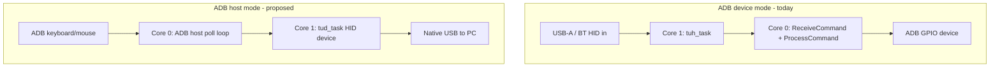

# ADB host mode — product spec

**Status:** **MVP shipped (2026-06-28)** — firmware **2.0.0** / **2.1.0** (GPIO split) / **2.2.0** (host reliability); flash `dist/BT-USB-ADB-Adapter-firmware-pico2_w-host.uf2` from `./build-all.sh`  
**Related:** [`FUTURE_WORK.md`](FUTURE_WORK.md) §10, [`hardware.md`](hardware.md), [`adb-passthrough-hub.md`](adb-passthrough-hub.md), [`adb-host-mode-capture.md`](adb-host-mode-capture.md), [`troubleshooting.md`](troubleshooting.md), [`bluetooth-pairing.md`](bluetooth-pairing.md) (BT pairing is **ADB → Mac** only)

---

## 1. Goal

Add a **second operating mode** to the existing BT-USB-ADB-Adapter firmware:

| Mode (today) | **ADB host mode (proposed)** |
|--------------|------------------------------|
| USB/BT HID **in** → ADB **device** out | ADB accessories **in** → USB HID **device** out |
| Vintage Mac is the ADB bus master | Pico is the ADB bus master |
| Pico USB port is a **host** (keyboard/mouse) | Pico USB port is a **device** (to modern PC/Mac) |

**Primary use case:** plug a real **ADB keyboard and/or mouse** into the adapter’s ADB port(s), **switch to ADB host mode manually**, connect the Pico’s USB to a modern computer, and have the PC see a standard USB keyboard and mouse.

**Mode selection:** **Manual only** for v1 (and likely permanently). The user explicitly chooses **ADB device mode** (USB/BT → vintage Mac) or **ADB host mode** (ADB accessories → PC). No automatic switching based on VBUS or bus traffic.

---

## 2. Mode selection — manual (design decision)

### 2.1 Why manual

Automatic host/device detection is technically possible (VBUS, USB enumeration, ADB Attention) but a poor fit for this product:

- **Mutually exclusive USB roles** — one port cannot be USB host (peripherals) and USB device (to PC) at the same time; auto-switch mid-session is surprising.
- **Vintage Mac usage** — connections expect power-off wiring changes, not hot role flips.
- **Firmware update** — BOOTSEL / UF2 is a separate state; auto-detect must never fight flashing.
- **Debug / UART** — USB cable to a PC for logging should not flip the adapter into host mode.
- **Two ADB masters** — user must not have a vintage Mac polling the bus while the Pico is ADB host; a deliberate mode choice makes that obvious.

**Decision:** ship **explicit user control** — OLED + buttons, persisted in flash, with a clear physical setup checklist for each mode.

### 2.2 User-facing modes

| Mode | OLED label (draft) | ADB role | USB role | Typical setup |
|------|-------------------|----------|----------|---------------|
| **Device** (default) | `ADB → Mac` | Slave (today) | Host — USB-A / BT HID in | USB kbd/mouse → adapter → vintage Mac |
| **Host** | `ADB → USB` | Master (poll bus) | Device — HID to PC | ADB kbd/mouse → adapter → PC via Pico USB |

A third mode (**monitor** / adbmon) remains a separate build or future screen — not part of host-mode v1.

### 2.3 How the user switches mode

**At runtime (primary):**

1. **Quick toggle:** press the **`*`** button (GP6) from **any** OLED screen — flips between **ADB → Mac** and **ADB → USB**, persists, returns to splash.
2. **Mode menu:** cycle with **`#`** (center) to the **ADB Mode** screen → **`˄`** = ADB→Mac, **`˯`** = ADB→USB, **`#`** = apply.
3. OLED splash shows active mode (`Mode: ADB>Mac` / `ADB>USB`).

**Persisted default:**

- Store in `FlashSettings` (new byte or `reserved_bytes` slot): `ADB_MODE_DEVICE` | `ADB_MODE_HOST`.
- On cold boot, start in the **saved** mode (default **device** for existing users).

**Headless / serial (optional):**

- Ghost-type or UART command to query/set mode (same as the LED toggle shortcut pattern).

**No auto-detect in v1** — and not planned unless requirements change.

### 2.4 Physical setup checklist (document in user guide)

**Switching to ADB host mode (`ADB → USB`):**

1. **Vintage Mac off**; adapter **not** acting as bus slave to a running Mac.
2. ADB keyboard/mouse plugged into adapter ADB port(s).
3. **Remove** USB-A peripherals (and disable BT pairing use — host mode does not bridge BT).
4. Select **ADB → USB** on OLED (`*` toggle or Mode screen); wait for mode switch complete (brief LED pattern).
5. Connect Pico **native USB** to modern PC.
6. PC should enumerate a USB keyboard + mouse.

**Switching back to device mode (`ADB → Mac`):**

1. Disconnect Pico from PC (or leave connected only if not in host mode — prefer disconnect).
2. Select **ADB → Mac** on OLED (`*` toggle or Mode screen).
3. Attach USB keyboard/mouse (and pair Bluetooth in **ADB → Mac** mode — see [`bluetooth-pairing.md`](bluetooth-pairing.md)).
4. **Mac off** → plug adapter into ADB → power on Mac (per [`hardware.md`](hardware.md)).

### 2.5 USB port constraint (unchanged)

The RP2040 has **one native USB controller**. Per session:

- **Device mode:** USB **host** (`tuh_init` on Core 1).
- **Host mode:** USB **device** (`tud_init` — HID to PC).

TinyUSB supports **dynamic host ↔ device switching** on user request (`tinyusb/examples/dual/dynamic_switch`), but not concurrent operation.

**Implication:** modes are mutually exclusive for USB-A peripherals, Bluepad32, and gamepad paths — only the selected mode runs.

---

## 2b. Hardware topology

From [`hardware.md`](hardware.md):

- **Two ADB ports** — one open-collector bus (pass-through; see [`adb-passthrough-hub.md`](adb-passthrough-hub.md)).
- **BSS138 level shifter** — GPIO 18 TX, GPIO 19 RX between Pico and 5 V ADB DATA.
- **Power** — normally from ADB +5 V (Schottky); USB-bridged for bench / host-mode tests.
- **Pico USB** — firmware update; in **host mode**, USB HID device to a modern PC.

**Host mode wiring:**

```
[ADB keyboard/mouse] ──► [ADB port A or B] ═══ shared bus ═══ [Pico GPIO 18/19 via BSS138]
                                                                        │
[Pico native USB] ◄─────────────────────────────────────────────────────┘
        │
   [Modern PC / Mac / Pi]  ← USB HID device (keyboard + mouse)
```

**Mac must be off and disconnected** — only one ADB bus master at a time.

---

## 3. Architecture

### 3.1 High-level diagram



### 3.2 Core assignment (match existing split)

| Core | ADB device mode (today) | ADB host mode |
|------|-------------------------|---------------|
| **Core 0** | ADB slave bit-bang, OLED, BT poll | ADB **master** poll, OLED, mode FSM |
| **Core 1** | `tuh_task`, USB HID host | `tud_task`, USB HID **device** |

Mode switch requires **stopping the inactive stack** on each core (no `tuh_task` while in host mode; no `ReceiveCommand` device loop while in host mode).

### 3.3 New firmware modules (proposed)

| Module | Responsibility |
|--------|----------------|
| `adb_mode.c` / `adb_mode.h` | Mode FSM, **manual** switch API, flash persistence, OLED hooks |
| `adb_host.c` / `adb_host.h` | ADB master: Attention, Talk/Listen/Flush/Reset, SRQ wait |
| `adb_to_usb_kbd.cpp` | ADB register 0/2 → USB HID keyboard reports (inverse of `adbkbdparser`) |
| `adb_to_usb_mouse.cpp` | ADB register 0 → USB HID mouse reports (inverse of `adbmouseparser`) |
| `usb_hid_device.c` | TinyUSB device descriptors, `tud_hid_*` callbacks |
| `tusb_config_dual.h` | `CFG_TUH` + `CFG_TUD` compiled; only one active at runtime |

Reuse from existing code:

- Bit timing: `place_bit0/1`, `send_byte`, `wait_data_*` from `adb.cpp` / `adb_platform.h`
- Register layouts: `adbregisters.h`, mouse/keyboard packing in parsers
- Hub collision GPIO (optional): may apply when multiple ADB devices share the bus

---

## 4. ADB host behaviour (functional spec)

### 4.1 Bus master responsibilities

On entering ADB host mode:

1. **Global reset** (optional on entry, required on “rescan”)
2. **Enumerate** addresses 0x02 (keyboard default), 0x03 (mouse default), optionally 0x04–0x07 if hub devices present
3. **Poll loop:**
   - Wait for SRQ **or** periodic Talk R0 to known devices
   - On keyboard Talk R0: decode → USB HID keyboard report
   - On mouse Talk R0: decode → USB HID mouse report
   - Handle Talk R3 / Listen R3 for address collision (reuse hub enumeration logic inverted — we are the host)

### 4.2 Polling strategy (v1)

- **SRQ-driven** when devices assert service request (stretch stop bit)
- **Fallback periodic Talk** (e.g. every 8–16 ms) if no SRQ — mice need steady polling
- **Do not** replicate IIgs mouse SRQ suppression — we are not an IIgs

### 4.3 Multi-device

| Scenario | v1 | Later |
|----------|----|-------|
| ADB keyboard @ 0x02 + mouse @ 0x03 | **Target** | — |
| Chained second keyboard/mouse | Listen R3 relocation | Same as hub doc |
| Trackball + keyboard | Enumerate both | Optional second USB HID mouse interface |
| Joystick / Gravis | Out of scope | §11 Gravis / adbmon traces |

### 4.4 USB HID device presentation (v1)

Present **one composite HID device** to the PC:

- Interface 0: boot keyboard (or NKRO if needed for ADB extended keys)
- Interface 1: boot mouse (buttons + relative X/Y; wheel if ADB register supports it)

Match boot protocol first for OS compatibility; report protocol later.

---

## 5. Translation layer

### 5.1 Keyboard (ADB → USB)

Inverse of `usb_keycode_to_adb_code` / `ADBKbdRptParser::GetAdbRegister0()`:

- ADB register 0: key code + modifiers (Apple encoding)
- ADB register 2: LED state from **host** (PC) OUT reports → Listen R2 to keyboard

### 5.2 Mouse (ADB → USB)

Inverse of `ADBMouseRptParser::GetAdbRegister0()`:

- ADB register 0: buttons, ΔX, ΔY (sign-magnitude nibble format)
- Map to USB HID boot mouse report (8-bit deltas, clamp if needed)

### 5.3 LED / caps lock path

PC sends HID LED output → firmware → ADB Listen R2 (keyboard). Required for caps lock LED on ADB keyboard.

---

## 6. Mode switching (manual)

### 6.1 States

```
BOOT
  → INIT_HARDWARE
  → READ_FLASH_MODE (default: ADB_DEVICE_MODE)
  → ADB_DEVICE_MODE | ADB_HOST_MODE

ADB_DEVICE_MODE ←──(user selects on OLED / serial)──→ ADB_HOST_MODE
```

Mode changes only when the user requests them (or on boot from flash). **No** background VBUS or ADB-traffic policy.

### 6.2 User-initiated switch procedure

Triggered from OLED confirm or serial command:

1. Set state `SWITCHING`; show “Switching…” on OLED.
2. Core 0: exit current ADB loop; release bus (high-Z).
3. Core 1: deinit active USB stack (`tuh_deinit` or `tud_deinit` per TinyUSB `dynamic_switch`).
4. Re-init target stack (`tuh_init` for device mode, `tud_init` for host mode).
5. Core 0: enter target ADB loop (slave `ReceiveCommand` vs master poll).
6. Update OLED footer and splash label.
7. If user checked “remember”, write mode to `FlashSettings`.
8. Return to stable mode; optional LED blink pattern per mode.

**Block switching while:**

- BOOTSEL / UF2 active
- Core 1 flash pause in progress (`bt_host_coop` — only relevant in device mode)

**Recommended UX:** require **confirm** on mode screen so a stray button press does not swap stacks mid-use.

### 6.3 Boot behaviour

- Read saved mode from flash.
- If unset / legacy flash → **ADB device mode** (preserves today’s behaviour for upgraded units).
- Apply mode before starting Core 1 USB stack and Core 0 ADB loop.
- Splash screen shows active mode for 2 s.

---

## 7. Coexistence with other features

| Feature | ADB device mode | ADB host mode |
|---------|-----------------|---------------|
| USB HID host (USB-A) | Yes | **No** |
| Bluetooth bridge | Yes | **No** (v1) |
| Gamepad emulation | Yes | **No** |
| Passthrough hub (relocated addresses) | Yes (we are device) | Partial — we are host; downstream chain still visible electrically |
| adbmon | Separate build | Could add snoop-only sub-mode later |
| OLED UI | Yes | Yes — mode indicator + ADB device count |

---

## 8. Phased delivery

### Phase 0 — Spec & spikes (this doc)

- [ ] Confirm ultramegausb board USB and ADB wiring
- [ ] Spike: `dynamic_switch` + HID device on Pico
- [ ] Spike: ADB master sends Talk R0, reads mouse reg from real trackball
- [ ] adbmon trace of Mac host poll loop as reference fixture

### Phase 1 — MVP (manual mode only)

- [ ] Mode FSM + **OLED mode screen** (select + confirm + optional “remember”)
- [ ] Flash persistence for default mode
- [ ] ADB host poll: keyboard @ 0x02, mouse @ 0x03
- [ ] USB HID composite device (kbd + mouse)
- [ ] ADB → USB translation for standard register 0 formats
- [ ] User setup notes in README / [`hardware.md`](hardware.md)

### Phase 2 — Polish

- [ ] USB HID LED → ADB Listen R2 (caps lock on ADB keyboard)
- [ ] Enumeration / relocation for chained ADB devices
- [ ] Hub hat policy documented (support matrix)

### Phase 3 — Advanced

- [ ] Multiple ADB pointing devices → multiple USB HID interfaces
- [ ] Joystick / tablet paths
- [ ] Optional: VBUS hint on mode screen only (“PC USB detected — switch to ADB→USB?”) — **not** auto-switch

---

## 9. Risks and open questions

| # | Question | Impact |
|---|----------|--------|
| 1 | OLED mode screen placement (new screen vs settings submenu) | UX — align with ui-alignment flow |
| 2 | Hub hat supported in `ADB → USB` mode? | Likely **no** for v1 |
| 3 | ADB bus power in host mode | On the ultramegausb board: Pico USB +5 V bridged past Schottky (see [`hardware.md`](hardware.md)); ensure DATA pull-up to +5 V when Mac is off |
| 4 | User education: never connect vintage Mac while in host mode | Safety / docs |
| 5 | RP2350 / Pico 2 W: same single-PHY constraint? | Yes for native USB |
| 6 | PIO USB second port — future “device + host” split? | Out of scope v1 |

---

## 10. Success criteria (Phase 1)

- [x] User can select **ADB → Mac** vs **ADB → USB** on OLED, with flash persistence — **2026-06-28**
- [x] After switch to host mode: ADB keyboard + mouse → PC via Pico USB works — **2026-06-28**
- [x] After switch back: USB/BT peripherals → vintage Mac works (GPIO split **2.1.0** fixes BT mouse) — **2026-06-28**
- [x] Splash / **ADB Bus** screen shows active mode and device status — **2026-06-28**
- [x] Unified `-host` build with runtime toggle — **2026-06-28**

---

## 11. Build / config

Shipped in **`./build-all.sh`**:

| UF2 | Flags |
|-----|--------|
| `dist/BT-USB-ADB-Adapter-firmware-pico2_w-host.uf2` | `ADB_HOST_MODE=ON` |
| `dist/BT-USB-ADB-Adapter-firmware-pico2_w-host-debug.uf2` | `ADB_HOST_MODE=ON`, `ADB_DEBUG=ON` |

```cmake
option(ADB_HOST_MODE "Enable ADB host → USB HID mode (runtime switch)" OFF)
```

When ON at compile time: dual-mode FSM + host bus master code. **Default runtime mode: ADB device** (ADB → Mac). User switches via OLED.

### Host bus timing (required)

Implemented in `adb_host.cpp` only — see [`troubleshooting.md`](troubleshooting.md):

- **765 µs** attention low before `place_bit1()` (800 µs total, QMK/TMK pattern)
- RX preamble: `wait_data_hi(500)` then `wait_data_lo(500)` before decoding Talk replies
- Host TX GPIO: open-collector via `adb_host_gpio.h` (not shared `adb_platform.h`)

---

## 12. References

- [`adb.cpp`](../src/firmware/lib/adb/src/adb.cpp) — device-side bit bang (reuse timing)
- [`adbkbdparser.cpp`](../src/firmware/lib/adb/src/adbkbdparser.cpp) / [`adbmouseparser.cpp`](../src/firmware/lib/adb/src/adbmouseparser.cpp) — translation reference
- TinyUSB [`dynamic_switch`](../src/firmware/tinyusb/examples/dual/dynamic_switch/) — host/device swap
- [`adb-shared-gpio-rollback.md`](adb-shared-gpio-rollback.md) — GPIO split and restore notes
- [`troubleshooting.md`](troubleshooting.md) — host timing and device-mode collision fix
- Apple ADB Manager PDF (linked from README)
