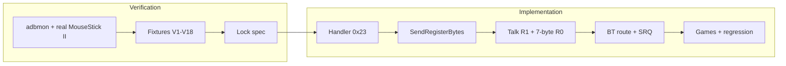

# Gravis MouseStick II — verification & implementation plan

**Goal:** Emulate a real **Gravis MouseStick II** on the ADB bus (handler **0x23**) so a vintage Mac running the **Gravis cdev** sees an authentic stick — while the physical input is a **Bluetooth gamepad** (Bluepad32) on the adapter.

**Status:** Planning — no firmware changes yet.

**References:**

- [`gravis_mousestick_ii.md`](gravis_mousestick_ii.md) — register layouts (draft from community)
- [`gamepad-support.md`](gamepad-support.md) — Phase B (0x01) today; Phase C / mode 2 target
- [`adb_device_list.md`](adb_device_list.md) — MouseStick II @ **0x03**, handler **0x23**
- [`FUTURE_WORK.md`](FUTURE_WORK.md) §5 (ADBMON), §11 (Gravis)
- [`adb-passthrough-hub.md`](adb-passthrough-hub.md) — if keyboard/mouse share the bus

**Today (Phase B):** BT gamepad → keyboard keys + 16-bit mouse reg0 (handler **0x01** semantics). Handler switch to **0x23**, **Talk R1**, and **multi-byte Talk R0** are **not** implemented.

---

## 1. Why capture first (real MouseStick II + adbmon)

The Gravis path is **host-driven**: the Mac’s **cdev** issues **Listen** commands and expects specific **Talk** payloads. Our [`gravis_mousestick_ii.md`](gravis_mousestick_ii.md) is a good sketch but does not replace a trace from **your** stick on **your** Mac/OS/cdev version.

**Principle:** sniff first, implement second, diff emulator vs hardware until traces match.

---

## 2. Bench setup

### 2.1 Hardware

| Item | Role |
|------|------|
| Vintage Mac (68K or IIgs) | ADB bus master |
| **Gravis MouseStick II** | Reference device |
| Gravis **cdev** / control panel installed | Performs **0x01 → 0x23** handler switch |
| ADB bus monitor (**adbmon**) | Passive decode on DATA line → UART |
| Optional: BT-USB-ADB-Adapter (not emulating) | Second ADB port for daisy-chain, or spare board flashed adbmon-only |

**Mac off** for wiring changes; power on after chain is stable ([`hardware.md`](hardware.md)).

### 2.2 Recommended topology

**Option A — simplest (reference capture)**

```text
[Mac ADB] ──► [MouseStick II only]
                  ▲
                  │ DATA tap (high-Z monitor)
            [adbmon Pico on ADB IN GPIO]
```

Use a **second** Pico (or adapter board running **adbmon** firmware only) wired to **ADB DATA** (GPIO **19** IN — see [`hardware.md`](hardware.md)). Monitor must **not** drive the bus.

**Option B — daisy-chain (closer to adapter product)**

```text
[Mac ADB] ──► [Adapter ADB port 1] ──► [MouseStick II on port 2]
                    ▲
              [adbmon tap]
```

Confirms behaviour when another device shares the open-collector bus (relevant to hub mode later).

### 2.3 adbmon firmware & UART

- Build: **`adbmon-pico`** when available on `feature/adbmon`, or legacy monitor from [`src/adbmon/`](../src/adbmon/) (port to Pico if needed).
- UART: **GP0 / Pico pin 1** @ **115200** (match adapter debug wiring) — see [`changes.md`](changes.md).
- Save sessions to a text file on the host (`script`, `screen` log, or serial terminal capture).

### 2.4 Software on the Mac

- Note **Mac model**, **OS version** (e.g. System 7.1, 7.5, IIgs GS/OS).
- Note **Gravis cdev / control panel** version if visible.
- Install cdev **before** capture sessions that include handler **0x23**.

---

## 3. Verification plan (open questions → capture sessions)

Each session: **one variable at a time**, 10–30 s of log, label the file (`gravis-boot-7byte-idle.txt`, etc.).

### 3.1 Bus identity & enumeration

| # | Session | What to do | What we need from the log |
|---|---------|------------|---------------------------|
| V1 | **Cold boot** | Mac off → stick plugged → power on | **Talk R3** @ **0x03** — confirm handler **0x01**, address **0x03** |
| V2 | **After global reset** | Restart Mac or bus reset | Address/handler again; any **Flush** @ 0x03 |
| V3 | **Idle 30 s** | Don't touch stick | Poll cadence; any **SRQ** extension on host commands |

**Deliverable:** Baseline “stock mouse” phase before Gravis software runs.

### 3.2 Handler switch (0x01 → 0x23)

| # | Session | What to do | What we need from the log |
|---|---------|------------|---------------------------|
| V4 | **Open Gravis control panel** | Launch cdev / extension | **Listen R3** payload(s) to **0x03** — exact 16-bit write(s) |
| V5 | **After cdev loaded** | Talk R3 again | Handler byte now **0x23**? |
| V6 | **Repeat V4** on second boot | Confirm sequence is stable | Order: Listen before Talk; multiple Listens? |

**Deliverable:** Exact bytes we must accept on **Listen R3** and store as `mouse_handler_id = 0x23`.

### 3.3 Talk R1 (protocol ID)

| # | Session | What to do | What we need from the log |
|---|---------|------------|---------------------------|
| V7 | **After 0x23 active** | Idle | **Talk R1** @ 0x03 — expect **0x03 0x00** and/or **0x04 0x00** per doc |
| V8 | **Toggle cdev 7-byte vs 3-byte** (if UI exists) | Change protocol setting | Does Talk R1 response change? |

**Deliverable:** Which protocol ID(s) your Mac/cdev actually uses (default to **7-byte** for MVP if only one appears).

### 3.4 Talk R0 — 7-byte protocol (priority)

| # | Session | What to do | What we need from the log |
|---|---------|------------|---------------------------|
| V9 | **Centered, no buttons** | Release stick | 7 bytes (or 2×16-bit + extras) — **idle baseline** |
| V10 | **Full left / right / up / down** | Hold each ~2 s | Joystick X/Y **max magnitude** (doc says ~±600) |
| V11 | **Each button alone** | Buttons 1–5 per doc | Byte 7 button map — confirm **active low** (0 = down) |
| V12 | **Diagonal + button combos** | Corner + trigger | Encoding when axes + buttons combined |
| V13 | **Trackball / mouse ring** (if your unit has it) | Move ball, click | Bytes 1–2 **mouse field** — same as standard ADB mouse? |
| V14 | **Stick + ball together** | Both moving | Independent fields or interaction |

**Deliverable:** Fixture hex lines for Talk R0 @ 0x03 reg 0 (7-byte), e.g. `Talk @3 R0: xx xx xx xx xx xx xx`.

### 3.5 Talk R0 — 3-byte protocol (if V7/V8 shows 0x0400)

| # | Session | What to do | What we need from the log |
|---|---------|------------|---------------------------|
| V15 | **Center / extremes** | Same as V9–V10 | X/Y as **0x80** center, **0x00** / **0xFF** extremes? |
| V16 | **Buttons** | Same as V11 | 3rd byte button layout |

**Deliverable:** Optional second fixture set; skip MVP if host never uses 3-byte on your rig.

### 3.6 SRQ & timing

| # | Session | What to do | What we need from the log |
|---|---------|------------|---------------------------|
| V17 | **Move stick quickly** | Watch host cmds | Does device **stretch SRQ** (extra bit after command)? |
| V18 | **Compare idle vs motion** | | Talk R0 only after SRQ vs periodic poll |

**Deliverable:** Whether emulator must assert **mousesrq** on gamepad updates in 0x23 mode (likely yes).

### 3.7 Edge cases

| # | Session | What to do | What we need |
|---|---------|------------|--------------|
| V19 | **Quit Gravis panel / extension off** | | Revert to **0x01**? |
| V20 | **Sleep / wake** | | Re-enumeration sequence |
| V21 | **IIgs only** (if applicable) | Repeat V4–V14 | IIgs-specific differences |

---

## 4. Capture log format (normalize traces)

For each interesting **Talk** or **Listen**, record:

```text
# gravis-V9-idle-7byte.txt
OS: System 7.5.5  Mac: Quadra 700  cdev: Gravis Mouse 2.x
ADB cmd=2C Talk @03 R0  bytes=7  data=E0 00 00 00 00 00 F8
```

Decode command byte:

- Address = `(cmd >> 4) & 0x0F`
- Register = `cmd & 0x03`
- Talk vs Listen = `(cmd & 0x0C)`

Store fixtures under `docs/fixtures/gravis/` (create when first traces exist) for regression.

---

## 5. Gap analysis (doc vs hardware)

After captures, fill this table:

| Topic | [`gravis_mousestick_ii.md`](gravis_mousestick_ii.md) | Measured on real stick | Action |
|-------|--------------------------------------------------------|-------------------------|--------|
| Default handler @ 0x03 | 0x01 | | |
| After cdev | 0x23 | | |
| Talk R1 response | 0x0300 / 0x0400 | | |
| Talk R0 length | 7 or 3 bytes | | |
| Axis range | ±600 | | |
| Button idle byte | bits 7–5 = 1 | | |
| Mouse subfield in 7-byte | standard mouse reg | | |
| SRQ on motion | (unspecified) | | |

---

## 6. Implementation plan (BT gamepad → ADB device mode)

**Scope:** Bluetooth gamepad only (Phase B bridge). **Not** USB HID gamepads in v1. **Not** ADB host mode.

### Phase 0 — Fixtures & spec lock (blocked on §3)

- [ ] Complete verification sessions **V1–V14** minimum (V15–V16 if 3-byte appears).
- [ ] Check in fixture files + update [`gravis_mousestick_ii.md`](gravis_mousestick_ii.md) with “confirmed” notes.
- [ ] Choose MVP protocol: **7-byte** unless traces show host only uses 3-byte.

**Exit:** Written spec addendum with hex fixtures; no guesswork on Talk R0 layout.

### Phase 1 — Handler lifecycle (`adb.cpp`)

- [ ] On **Listen R3** @ mouse address: accept handler **0x23** (today mouse handler change is commented out).
- [ ] Track `mouse_handler_id` in **Talk R3** responses (`GetAdbRegister3Mouse()` already uses it).
- [ ] On global reset / `AdbInterface::Reset()`: revert to **0x01**.
- [ ] **ADB_DEBUG** logs: `MOUSE: handler now 0x23`.

**Exit:** With cdev loaded, Mac sees handler **0x23** on Talk R3 (can test with **Phase B still active** — cdev may work before Talk 0 is correct).

### Phase 2 — Multi-byte ADB send (`adb.h` / `adb.cpp`)

- [ ] Add `SendRegisterBytes(const uint8_t *buf, size_t len)` using existing `place_bit0/1` + `send_byte` + stop bit.
- [ ] Unit-test on bench with **adbmon**: host Talk R0 → emulator echoes fixture payload (loopback test firmware optional).

**Exit:** Can transmit **7 bytes** on Talk R0 within Mac Tlt window (~260 µs to first bit — same constraint as today’s mouse).

### Phase 3 — Talk R1 (`adb.cpp`)

- [ ] On **Talk R1** @ mouse_addr when `mouse_handler_id == 0x23`: `Send16bitRegister(0x0300)` (or traced value).

**Exit:** Matches fixture **V7**.

### Phase 4 — Gravis encoder (`adb_gravis.cpp` new module)

- [ ] Input: latest `uni_gamepad_t` from Bluepad32 (same snapshot as `bt_hid_bridge.cpp`).
- [ ] Output: 7-byte (or 3-byte) buffer per fixtures.
- [ ] **Axis map:** left stick → joystick X/Y; scale ±512 → measured ±600 (or 0x80-centered 8-bit).
- [ ] **Button map (draft — confirm on hardware):**

  | Gravis (doc) | Suggested BT source |
  |--------------|---------------------|
  | Trigger (1) | A |
  | Top circle (2) | B |
  | Bottom circle (3) | X |
  | Left top (4) | Y |
  | Right top (5) | Shoulder R |

- [ ] **Mouse field (bytes 1–2):** right stick → deltas **or** zero until V13 shows real stick uses trackball separately; optional L1/R2 → mouse button bits.
- [ ] Set `mousepending` when buffer changes.

**Exit:** Talk R0 payloads match fixtures **V9–V12** when BT pad mimics same motions (manual compare via adbmon on a **second** test: emulator vs stick — or compare hex to fixture files).

### Phase 5 — Route BT gamepad by handler (`bt_hid_bridge.cpp`)

- [ ] If `mouse_handler_id != 0x23`: keep Phase B (keys + `MousePrs`).
- [ ] If `mouse_handler_id == 0x23`: **only** update Gravis encoder; do **not** call `KeyboardPrs` / standard `MousePrs` for gamepad.
- [ ] Preserve existing BT keyboard/mouse paths (separate devices).

**Exit:** With cdev + BT gamepad, Mac does not see spurious key events from pad.

### Phase 6 — SRQ (`quokkadb.cpp` / `adb.cpp`)

- [ ] When `mouse_handler_id == 0x23` and Gravis report changed: set `mousepending` + **mousesrq** per **V17–V18**.
- [ ] Revisit `ADB_IIGS_MOUSE_SUPPRESS_SRQ` policy for gamepad-as-Gravis (may need SRQ ON for this handler only).

**Exit:** Stick motion triggers host polls; no “stuck until poll” feel in control panel.

### Phase 7 — OLED & debug

- [ ] Splash / devices footer: `H:01` vs `H:23` (handler, host-driven — not user toggle).
- [ ] **ADB_DEBUG:** print Talk R0 hex when sent.

**Exit:** Bench visible state without adbmon.

### Phase 8 — Validation matrix

| Test | Pass criteria |
|------|----------------|
| Gravis control panel | Recognizes stick; axes center and move |
| **Keen Shoes** / known Gravis title | Gameplay with BT pad |
| BT keyboard + gamepad | Keyboard still works; gamepad is Gravis only |
| Hub + chained trackball on 0x03 | Document conflict; relocate if needed |
| IIgs (if target) | Repeat V21 + one game |
| Regression: handler **0x01** | Without cdev, Phase B still works |

---

## 7. Effort estimate (after fixtures)

| Phase | Effort |
|-------|--------|
| 0 Verification (your bench time) | 1–2 sessions × 2 h |
| 1–3 Handler + send + Talk R1 | ~3–4 days |
| 4–6 Encoder + routing + SRQ | ~4–6 days |
| 7–8 UI + game matrix | ~3–5 days |
| **Total firmware** | **~2–3 weeks** with good traces |

Without Phase 0, add significant trial-and-error time.

---

## 8. Risks & mitigations

| Risk | Mitigation |
|------|------------|
| 7-byte Talk too slow for Tlt | Pre-build buffer in main loop; send only in `ProcessCommand`; profile with GPIO toggle |
| BT timing vs ADB | Keep `bluepad32_poll()` **outside** `ReceiveCommand()` (see [`gamepad-support.md`](gamepad-support.md)) |
| Address **0x03** clash with hub trackball | Hub mode: relocate BT-Gravis to **0x04+** after host enumeration |
| Doc wrong on button bits | Fixtures **V11** are authoritative |
| cdev version differences | Capture Mac + cdev version in every fixture file |

---

## 9. Suggested order of work



1. Run **§3** captures this week with the real stick.
2. Drop fixture files in `docs/fixtures/gravis/`.
3. Implement **Phases 1–6** on `feature/gravis-mousestick` (or extend `feature/adb-host-mode` only if branched from main — prefer dedicated branch).
4. Keep **Phase B (0x01)** unchanged when cdev is not loaded.

---

## 10. Related docs to update when done

- [`gamepad-support.md`](gamepad-support.md) — mode 2 status → implemented
- [`FUTURE_WORK.md`](FUTURE_WORK.md) §11 — checkboxes
- [`release-notes.md`](release-notes.md) — user-facing Gravis + BT gamepad note
